<<<<<<< HEAD
# rice-disease-detection-miniprogram
=======
# 水稻病虫害检测系统

基于 Django REST Framework + 微信小程序示例前端的水稻病虫害检测 MVP，包含：

- 图片上传检测
- 检测结果可视化
- 病虫害建议生成（支持 DeepSeek API，未配置时自动降级）
- 数据集图片采集归档
- 自定义管理员后台

## 目录

- `rice_guard/`: Django 项目配置
- `apps/accounts/`: 账号体系与登录
- `apps/ai_analysis/`: DeepSeek 调用、提示词构造、AI 建议持久化
- `apps/web_portal/`: 普通用户网页端
- `apps/diagnosis/`: 检测记录、模型推理、可视化、模型配置
- `apps/dataset/`: 数据集采集归档
- `apps/dashboard/`: 自定义管理后台
- `frontend_web/`: 独立网页前端模板
- `miniapp/`: 微信小程序前端工程
- `docs/images/`: README 展示用的小程序界面截图

## 界面预览

小程序底部共 5 个标签页：**检测 / 历史 / 采集 / 统计 / 我的**。

| 上传检测 | AI 防治建议 |
| --- | --- |
| 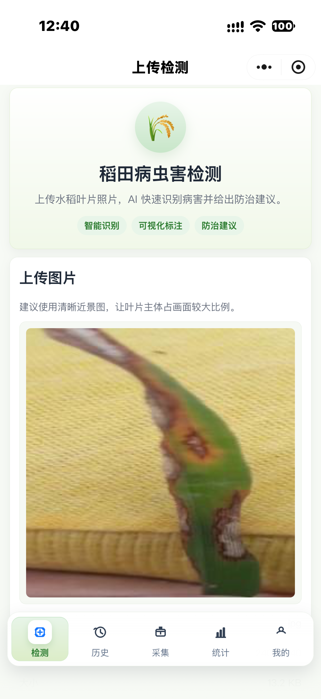 | 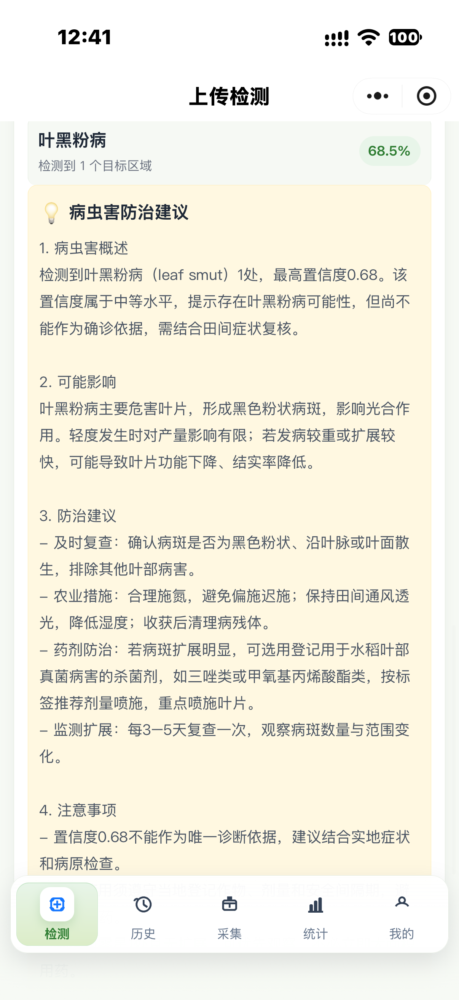 |
| 上传叶片照片，识别病虫害并给出防治建议 | 识别到叶黑粉病 68.5%，DeepSeek 生成分节建议 |

| 检测结果详情 | 检测历史 |
| --- | --- |
| 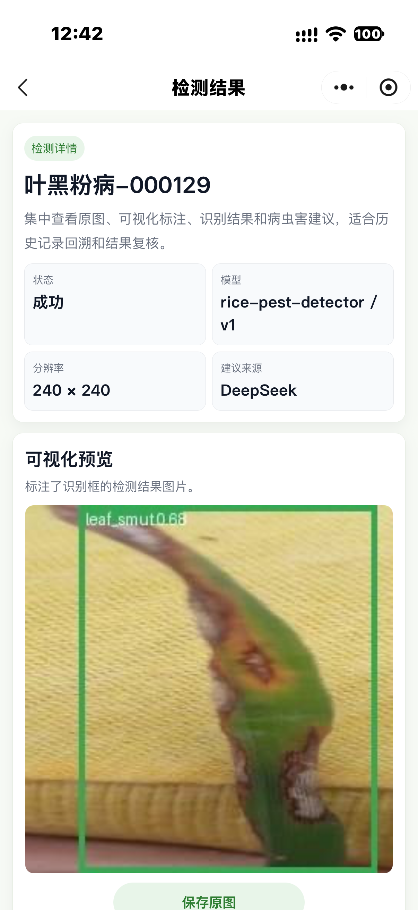 | 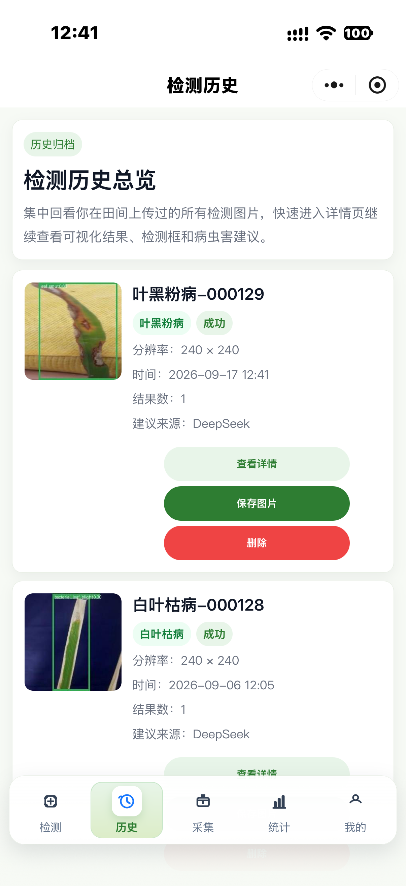 |
| 可视化标注框、模型版本、分辨率、建议来源 | 历史归档，支持查看详情 / 保存图片 / 删除 |

| 数据采集 | 数据统计 |
| --- | --- |
| 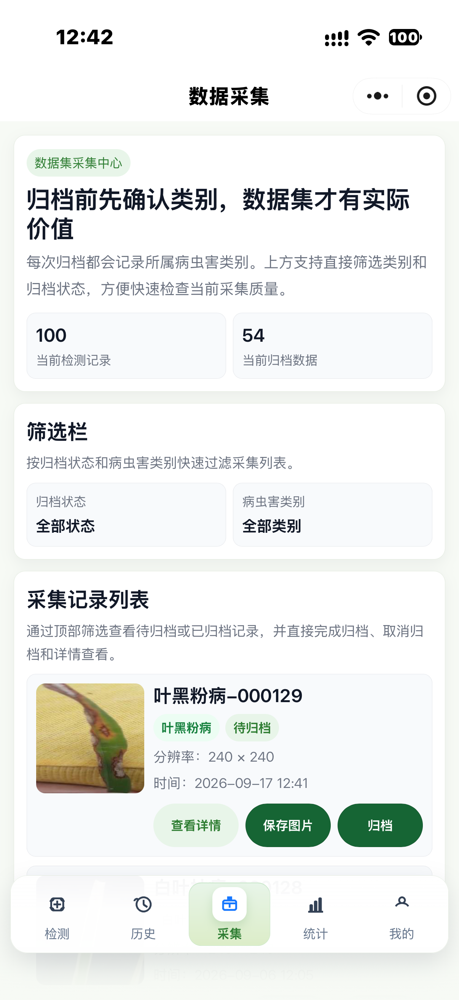 | 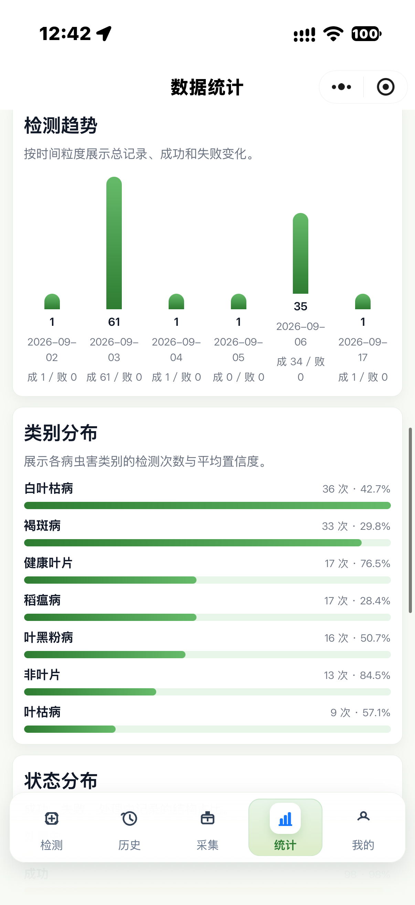 |
| 采集并归档数据集图片，用于后续训练 | 检测趋势与病虫害类别分布 |

| 我的 |
| --- |
| 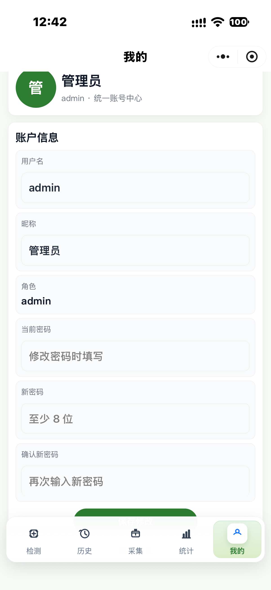 |
| 账户信息与修改密码 |

<details>
<summary>更多界面截图</summary>

| | |
| --- | --- |
| 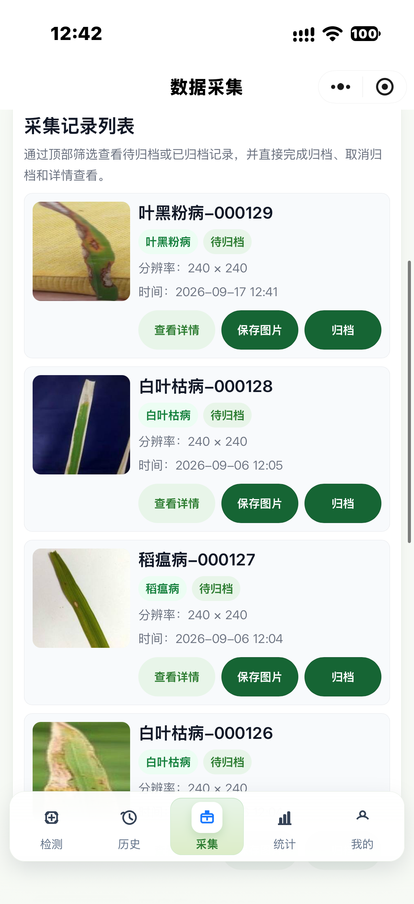 | 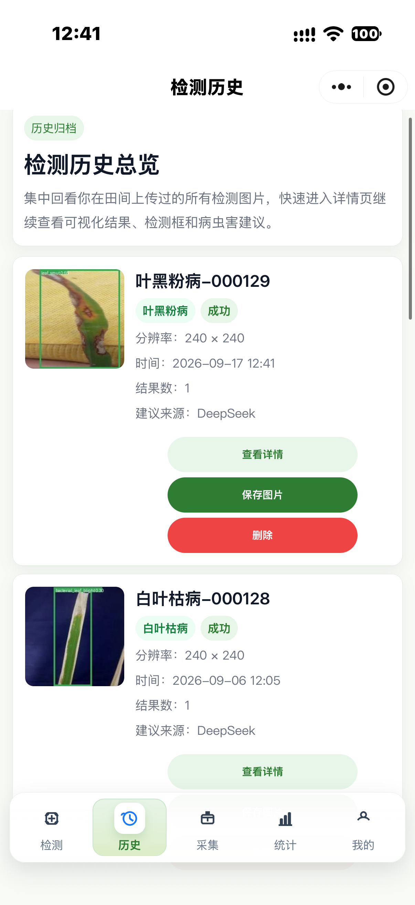 |
| 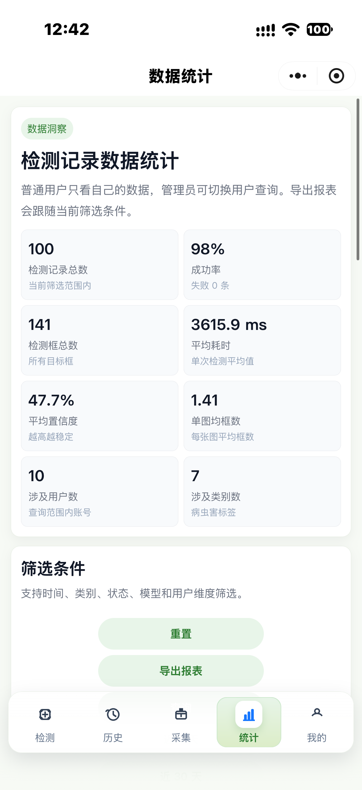 | 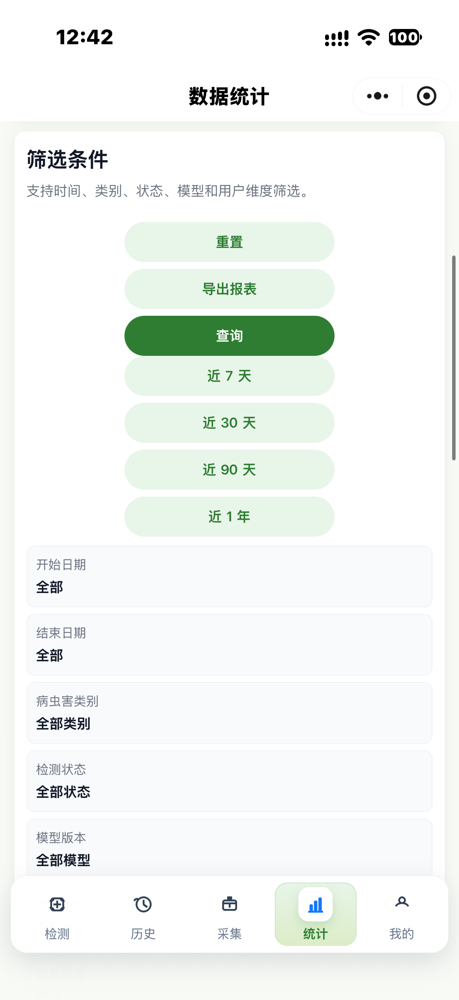 |

</details>

## 快速启动

1. 安装依赖

```bash
python -m pip install -r requirements.txt
```

2. 配置环境变量

复制 `.env.example`，至少配置以下变量：

```env
DJANGO_SECRET_KEY=replace-me
DJANGO_DEBUG=True
MODEL_BACKEND=mock
DEEPSEEK_API_KEY=
```

如果只部署后端 + 小程序，把网页前端关闭：

```env
ENABLE_WEB_FRONTEND=False
```

3. 执行迁移

```bash
python manage.py migrate
```

4. 创建管理员账号

方式一（推荐，可脚本化）：在 `.env` 中设置 `DJANGO_ADMIN_PASSWORD`，执行 `python manage.py migrate` 时会自动创建管理员。用户名默认 `admin`，可用 `DJANGO_ADMIN_USERNAME` 覆盖，昵称用 `DJANGO_ADMIN_NICKNAME`。
留空则安全跳过（代码中不再有默认口令）。

方式二（手动）：先创建用户，再在 Django shell 中补管理员角色。

```bash
python manage.py createsuperuser
```

```bash
python manage.py shell
```

```python
from django.contrib.auth import get_user_model
User = get_user_model()
u = User.objects.get(username="你的管理员用户名")
u.role = "admin"
u.save()
```

5. 启动服务

```bash
python manage.py runserver
```

## 云托管部署

把本项目（含 `Dockerfile` 的目录）作为上传目录推送到云托管。

云托管环境变量至少配置：

```env
DJANGO_SECRET_KEY=<随机长字符串>
DJANGO_DEBUG=False
DJANGO_ALLOWED_HOSTS=<你的公网域名>
ENABLE_WEB_FRONTEND=False
MYSQL_DATABASE=rice_guard
MYSQL_USER=root
MYSQL_PASSWORD=<你的数据库密码>
MYSQL_HOST=<你的数据库地址>
MYSQL_PORT=3306
MODEL_BACKEND=onnx
ULTRALYTICS_WEIGHTS_PATH=/app/0712_null/weights/best.onnx
DEEPSEEK_API_KEY=<你的DeepSeek密钥>
```

容器监听端口：`8080`

> 镜像**不含** `.env`：数据库密码、`DJANGO_SECRET_KEY`、`DEEPSEEK_API_KEY` 全部由云托管的环境变量注入。
> `DJANGO_ALLOWED_HOSTS` 必须包含你的公网域名（逗号分隔多个），否则 Django 会拒绝请求。
> 是否走 MySQL 由 `MYSQL_HOST` / `MYSQL_ADDRESS` 是否为空决定，两者都留空则回退到 SQLite。

## 关键接口

- `POST /api/auth/login/`
- `POST /api/auth/register/`
- `POST /api/detections/`
- `GET /api/detections/`
- `GET /api/detections/{id}/`
- `POST /api/dataset-images/`
- `GET /api/dataset-images/`
- `GET /api/admin/detections/`
- `GET /api/admin/dataset-images/`
- `GET /api/admin/model-configs/`

## 模型接入

默认使用 `mock` 后端，便于本地联调。要接入本地模型：

1. 设置环境变量

```env
MODEL_BACKEND=onnx
ULTRALYTICS_WEIGHTS_PATH=/path/to/best.onnx
DEFAULT_MODEL_CLASS_NAMES=healthy,brown_spot,leaf_scald,leaf_blast,bacterial_leaf_blight,leaf_smut,narrow_brown_spot,not_leaf
```

也可以在后台 `ModelConfig` 中切换启用模型配置。

当前仓库已检测到以下现有模型资源，可直接复用：

- 权重：`0712_null/weights/best.onnx`
- 类别来源：`data.yaml`

系统会优先读取 `best.onnx`，并使用 ONNXRuntime 推理。

也可以直接生成一条模型配置记录：

```bash
python manage.py bootstrap_model_config --activate
```

## DeepSeek 建议

配置以下变量即可启用：

```env
DEEPSEEK_API_KEY=your-api-key
DEEPSEEK_BASE_URL=https://api.deepseek.com
DEEPSEEK_MODEL=deepseek-chat
```

未配置时系统会返回本地规则生成的兜底建议。

## 管理后台

- 自定义后台入口：`/dashboard/login/`
- Django 原生后台：`/django-admin/`

## 网页端

- 首页：`/`
- 用户登录/注册：`/accounts/login/`、`/accounts/register/`
- 检测页：`/web/detections/`（上传和结果同页）
- 数据采集页：`/web/dataset/`

## 小程序端

- 首页：`/pages/index/index`（支持登录/注册 + 检测工作台）
- 登录页：`/pages/login/login`
- 检测页：`/pages/index/index`（上传和结果同页）

## 前端拆分

- `frontend_web/` 存放 Web 前端模板
- `miniapp/` 存放微信小程序前端
- 本地开发时两者都可以保留
- 部署后端时可以删除 `frontend_web/` 并把 `ENABLE_WEB_FRONTEND=False`

## 敏感信息与仓库卫生

本仓库按可公开托管整理，敏感值都不在代码里：

- **`.env` 不提交**：数据库密码、`DJANGO_SECRET_KEY`、`DEEPSEEK_API_KEY` 只放在本地 `.env` 或云托管环境变量中；仓库只提供 `.env.example`。
- **小程序部署信息**：云托管域名、微信云开发环境 ID、云托管服务名统一从 `miniapp/utils/config.js` 读取。
  把真实值写进同目录的 `miniapp/utils/config.local.js`（已在 `.gitignore` 中排除），格式见 `config.js` 顶部注释。
- **微信 AppID**：`project.config.json` 中留的是占位值 `touristappid`，请替换成自己的 AppID。
- **Docker 镜像不含 `.env`**：凭据由云托管环境变量注入，避免随镜像分发。
- **初始管理员**：密码来自 `DJANGO_ADMIN_PASSWORD`，代码中不存在默认口令。
- 运行期产物（`db.sqlite3`、`media/`、`test_media/`、`staticfiles/`、日志）均已在 `.gitignore` 中排除。

> ⚠️ 用 GitHub 网页版「拖拽上传 / Add file」不会读取 `.gitignore`，可能把本地 `.env` 一起传上去。
> 请用 `git add` + `git push` 提交，push 前用 `git status` 确认 `.env`、`config.local.js` 不在待提交列表里。
>>>>>>> d51a225 (Initial commit: Rice Disease Detection WeChat MiniProgram 水稻病害检测微信小程序)
